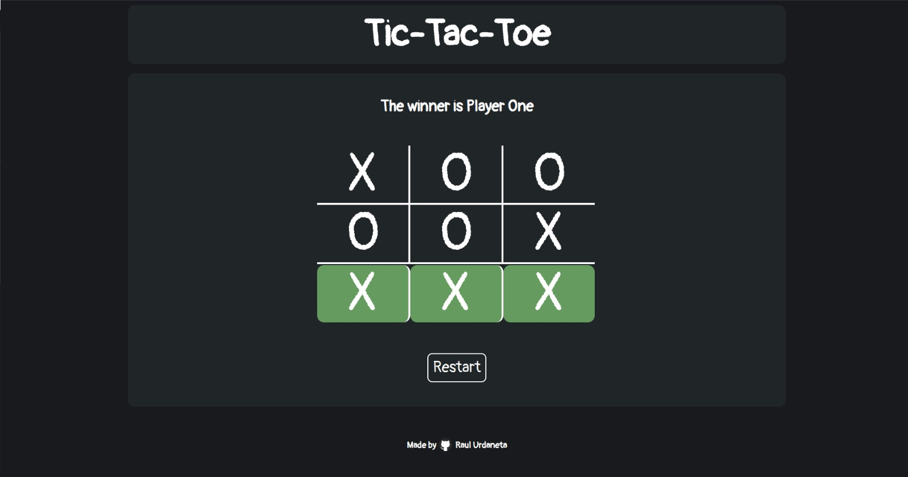
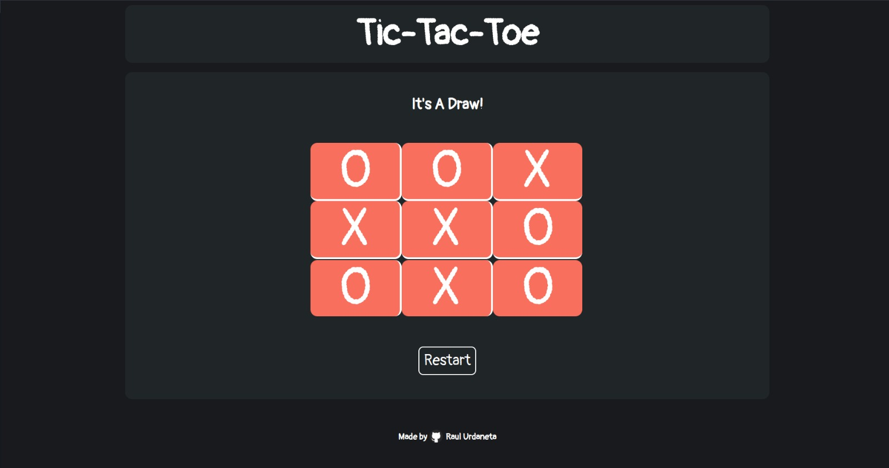

# tic-tac-toe

# Learnings
- Used factory functions for the first time.
- Using IIFE allowed to use inner functions of each factory function in another factory functions.
- Created and manipulated 2d array, including transforming it into a 1d array.
- Used an array to store a queryselectorAll instead of a node list.

[Live Demo](https://raulurdanetag.github.io/tic-tac-toe/) :point_left:
